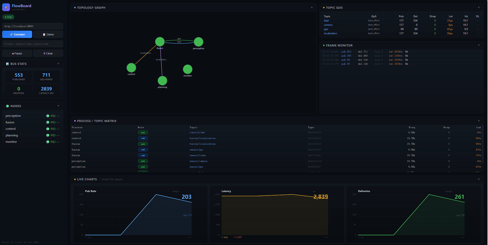

# FlowEngine

> 面向自动驾驶与机器人的仿真优先中间件框架 —— C11 内核、C++20 协程外壳、插件化架构。
>
> **定位：** FlowEngine 是一个*仿真优先、可复现的实验平台*。它明确**不**面向实车部署（不追车规量产、
> 不接真实 ECU/CAN、不追硬实时或功能安全认证）。所有能力——感知、融合、规划、控制、学习——
> 都在**仿真内**被运行、观察、测试、回放与评分。

[](https://github.com/caixuf/FlowEngine/actions)


---

## FlowEngine 是什么

一个从零搭建的中间件框架，灵感来自 Apollo CyberRT，以轻量、可嵌入的包提供核心抽象。
目标是**可组织、可观察、可测试、可回放、可评估——全部在仿真内**：

| 层 | 模块 |
|-------|---------|
| **通信** | Message Bus（发布/订阅 + 请求/应答 + 零拷贝）、IPC（SHM）、TCP Transport、Network Transport |
| **执行** | Coroutine Scheduler（FIFO + CPU 亲和 + 限频）、Choreo DAG 模式、可取消协程原语（发布/订阅 · select · timer · req-reply，含超时与优雅取消） |
| **内省** | 反射式状态机、UDP 服务发现、拓扑追踪、SysMonitor |
| **元信息** | FlowRegistry（tasks/topics/types/plugins/schemas）、ParamRegistry（int/float/bool/string，支持热重载） |
| **数据** | 类型安全序列化（IDL + 代码生成）、Bag v2 录制/回放、MCAP 格式、数据融合（EKF）、Schema 校验 |
| **QoS** | Per-topic QoS（深度 + 丢弃策略 + deadline + reliability）、Topic 统计（频率、延迟 p50/p99、订阅者） |
| **感知** | DBSCAN LiDAR 聚类、Kalman 跟踪、EKF 传感器融合、NMEA GPS 解析器、nuScenes 数据集加载器 |
| **规划** | Frenet 最优轨迹（变道/超车）、PID 控制（纵向 + 横向） |
| **安全** | 基于 FlowCoro 协程的安全包络（TTC / 横向交叉 / 行人保护） |
| **运维** | 统一日志器（毫秒时间戳）、flowctl CLI、FlowBoard Dashboard（Three.js 3D + 2D）、flowmond 监控守护进程（IPC 桥接 + 文件桥接）、跨进程 IPC Stats Bridge + Topic Bridge、CI/CD |
| **学习** | 仿真内学习闭环：数据采集 → 离线训练（scikit-learn MLP / PyTorch）→ 影子模式 tiny-MLP 推理 + 车端 SGD 微调 + 模型 OTA 与 A-B 对比。详见 [docs/LEARNING_LOOP.md](docs/LEARNING_LOOP.md) |

---

## 架构

```
┌──────────────────────────────────────────────────────────────────────┐
│                        FlowEngine Core (C11)                          │
│  ┌──────────┐ ┌──────────┐ ┌──────────┐ ┌──────────┐ ┌────────────┐ │
│  │ Message  │ │   IPC    │ │   Bag    │ │  Clock   │ │   State    │ │
│  │   Bus    │ │  (SHM)   │ │ (v2/MCAP)│ │ Service  │ │  Machine   │ │
│  └──────────┘ └──────────┘ └──────────┘ └──────────┘ └────────────┘ │
│  ┌──────────┐ ┌──────────┐ ┌──────────┐ ┌──────────┐ ┌────────────┐ │
│  │ Flow     │ │  Param   │ │ Discovery│ │ Serializer│ │   Task     │ │
│  │ Registry │ │ Registry │ │  (UDP)   │ │(IDL+FNV) │ │  Manager   │ │
│  └──────────┘ └──────────┘ └──────────┘ └──────────┘ └────────────┘ │
├──────────────────────────────────────────────────────────────────────┤
│                     FlowEngine Shell (C++20)                          │
│  ┌──────────┐ ┌──────────┐ ┌──────────┐ ┌──────────┐ ┌────────────┐ │
│  │ Coroutine│ │Scheduler │ │  Fusion  │ │Transport │ │  Network   │ │
│  │  Tasks   │ │(Choreo)  │ │ (EKF)    │ │(TCP/IPC) │ │  Transport │ │
│  └──────────┘ └──────────┘ └──────────┘ └──────────┘ └────────────┘ │
├──────────────────────────────────────────────────────────────────────┤
│                     ADAS Pipeline (dlopen plugins)                     │
│  sim_world → sensor_model → perception → fusion → planning → control │
│    → safety_control → inference → data_recorder → learner → model_ota│
│    → monitor                                                         │
└──────────────────────────────────────────────────────────────────────┘
                                                                         │
                      ════════════════════┼════════════════════
                                         │
                          ┌──────────────▼─────────────────────┐
                          │  flowmond 监控守护进程 :8800          │
                          │  IPC 桥接（首选）：stats_bridge /      │
                          │    dashboard_bridge → IPC SHM          │
                          │  文件桥接（回退）：轮询                 │
                          │    /tmp/flow_topology.json             │
                          │  → 托管 flowboard/index.html 前端       │
                          └────────────────────────────────────────┘
```

**可视化链路：** 由统一的 C 监控守护进程 `flowmond` 提供 HTTP 仪表盘，
同时启用 IPC 桥接（首选）与文件桥接（回退）两条等价数据链路，按可用性自动回退。
详见 [docs/VISUALIZATION_ARCHITECTURE.md](docs/VISUALIZATION_ARCHITECTURE.md)。

---

## 快速开始

```bash
git clone https://github.com/caixuf/FlowEngine.git && cd FlowEngine

# 一键演示（构建 + 运行，默认 15s）
bash scripts/demo.sh

# 或手动构建
bash build.sh release
```

> **入口：** `flow_launcher config/pipeline.json` 是运行 pipeline 的标准、
> 配置驱动方式（每个节点都是 `dlopen` 加载的 `.so` 插件）。

---

## 演示

```bash
bash scripts/demo.sh 30     # 30 秒演示

# 其他模式
bash scripts/demo.sh --multi      # 多进程模式（各节点独立 fork+exec）
bash scripts/demo.sh --record     # 录制 Bag 文件
bash scripts/demo.sh --no-browser # 不打开浏览器
```

```
  ╔══════════════════════════════════════════════════════════╗
  ║                                                          ║
  ║   ███████╗██╗      ██████╗ ██╗    ██╗                  ║
  ║   ██╔════╝██║     ██╔═══██╗██║    ██║                  ║
  ║   █████╗  ██║     ██║   ██║██║ █╗ ██║                  ║
  ║   ██╔══╝  ██║     ██║   ██║██║███╗██║                  ║
  ║   ██║     ███████╗╚██████╔╝╚███╔███╔╝                  ║
  ║   ╚═╝     ╚══════╝ ╚═════╝  ╚══╝╚══╝                   ║
  ║                                                          ║
  ║   E N G I N E                                           ║
  ║   面向自动驾驶的轻量级中间件                              ║
  ║                                                          ║
  ╚══════════════════════════════════════════════════════════╝

  ┌─ SimWorld ─→  Perception ─→  Fusion  ─→  Planning ─→  Control ┐
  │  dynamics      DBSCAN          EKF          Frenet       PID     │
  └──────────────────────────────────────────────────────────────────┘

  ⏱ 15s  |  pub=133 del=239 lat=141µs speed=11.2m/s
```


> *FlowBoard 实时仪表盘 —— 拓扑图、3D 场景、帧监控、延迟图表。演示期间打开 `http://localhost:8800`。*

**实时服务：**
| 服务 | 端口 | 说明 |
|------|------|------|
| FlowBoard Dashboard | `:8800` | 实时仪表盘（3D + 2D + D3 拓扑） |
| Foxglove 3D Bridge | `:8765` | Foxglove Studio WebSocket 桥接 |

---

## Pipeline

默认配置（`config/pipeline.json`）启动 **11 个插件节点**，默认场景为中凯路全场景（`scenarios/zhongkai_road_full.json`）：

| 节点 | 插件 (.so) | 频率 | 功能 |
|------|-----------|------|------|
| `sim_world` | `libsim_world.so` | 50Hz | 车辆动力学 + 障碍物模拟 + 场景加载 |
| `sensor_model` | `libsensor_model.so` | 20Hz | LiDAR/GPS/Camera 传感器模型（FOV/遮挡/噪声） |
| `perception` | `libperception_node.so` | 10Hz | DBSCAN 点云聚类 + 目标检测 |
| `fusion` | `libfusion_node.so` | 20Hz | EKF 传感器融合（定位 + 时间对齐） |
| `planning` | `libplanning_node.so` | 20Hz | Frenet 最优轨迹规划（变道/超车） |
| `control` | `libcontrol_node.so` | 50Hz | PID 纵横向控制 + Stanley 转向 |
| `safety_control` | `libsafety_control_node.so` | 协程 | FlowCoro 安全包围盒（TTC/横向/行人） |
| `inference` | `libinference_node.so` | 20Hz | tiny-MLP 影子推理（shadow mode，不执行） |
| `data_recorder` | `libdata_recorder_node.so` | 20Hz | 训练样本采集（模仿学习 JSONL） |
| `learner` | `liblearner_node.so` | 0.5Hz | 车端增量 SGD 微调（full/partial） |
| `model_ota` | `libmodel_ota_node.so` | 1Hz | 模型 OTA + 版本管理 + A-B 对比 |
| `monitor` | `libmonitor_node.so` | 10Hz | 系统监控 + 仪表盘 JSON 导出 |

---

## CLI

```bash
flowctl list tasks              # 注册任务列表
flowctl list topics             # 所有 topic 及统计
flowctl graph                   # ASCII 拓扑
flowctl state <task>            # 状态机状态
flowctl topic stats <topic>     # 单 topic 延迟/吞吐
flowctl bag info <file>         # Bag 元信息
flowctl schema <type>           # 类型定义
flowctl dashboard               # 启动 FlowBoard
flowctl version                 # 构建信息
flowctl param list              # 参数列表
flowctl param get <name>        # 获取参数
```

**其他工具：**

| 二进制 | 说明 |
|--------|------|
| `flow_launcher` | 配置驱动 pipeline 启动器（dlopen 加载插件） |
| `flowmond` | 监控守护进程（HTTP 仪表盘 + IPC 桥接 + 自动重连） |
| `flow_node_host` | 单节点插件宿主进程（用于多进程 fork+exec 模式） |
| `flow_mcap_replay` | MCAP 回放工具 |
| `flow_bag` | Bag 录制/回放 CLI |
| `flow_e2e` | 端到端演示二进制 |

---

## 可视化

可视化由统一的 C 监控守护进程 `flowmond` 提供，同时启用 IPC 桥接（首选）与
文件桥接（回退）两条数据链路。前端 `tools/flowboard/index.html` 由 flowmond 通过
`--html-path` 加载并托管。

```bash
# 终端 1：监控守护进程（加载前端，启用 IPC 桥接 + 文件桥接回退）
./build/bin/flowmond --html-path tools/flowboard/index.html

# 终端 2：运行 pipeline（写 /tmp/flow_topology.json + 发布 IPC 统计）
./build/bin/flow_launcher config/pipeline.json --duration 3600

# 打开浏览器
open http://localhost:8800
```

仪表盘端点：

| 路径 | 说明 |
|------|-------------|
| `/` | 实时 FlowBoard UI（3D 场景 + 拓扑 + 图表）|
| `/api/topics` | Per-topic 统计（频率/延迟/订阅者） |
| `/api/topology` | 拓扑 JSON（节点 + 边 + 指标）|
| `/api/stream` | SSE 实时推送（500 ms 间隔）|
| `/api/health` | 健康检查 |

> **绑定地址：** `flowmond` 默认监听 `127.0.0.1`（回环）。如需远程访问，
> 使用 `flowmond --bind 0.0.0.0`（或设置 `FLOWMOND_BIND_ADDR=0.0.0.0`）。

---

## Docker

```bash
docker build -t flowengine .
docker run --rm flowengine          # 运行 e2e 演示
docker run --rm flowengine demo 30  # 30 秒演示
```

---

## 从源码构建

| 依赖 | 版本 |
|-------------|---------|
| GCC | 11+（C++20 协程）|
| CMake | 3.16+ |
| libcjson | 任意版本（`apt install libcjson-dev`）|
| libeigen3 | 3.3+（`apt install libeigen3-dev`）—— **Frenet 规划器必需**（变道/超车）；缺失时 `planning_node` 会静默回退到仅车道保持 |
| Python | 3.8+（代码生成与仪表盘）|
| libprotobuf-c（可选）| 用于 protobuf 支持 |

```bash
cmake -S . -B build -DCMAKE_BUILD_TYPE=Release
cmake --build build -j$(nproc)

# 或一键构建
bash build.sh release
```

### 安装

```bash
sudo cmake --install build

# 验证
pkg-config --cflags --libs flowengine
flowctl version
```

安装完成后，按需引入各公共头文件：

```c
#include "task_interface.h"  /* 任务接口（TaskBase / TaskInterface） */
#include "message_bus.h"     /* 消息总线 */
#include "transport.h"       /* 传输层（local/IPC/TCP） */
```

---

## 插件系统

FlowEngine 采用基于 `dlopen` 的插件架构。每个 pipeline 节点是一个共享库（`.so`），
由 `flow_launcher` 在运行时加载。节点之间仅通过 Message Bus 通信——
节点之间没有直接函数调用。

```c
// C 插件 —— dlopen 兼容 ABI
#include "task_interface.h"

typedef struct { TaskBase base; int param; } MyTask;

static int my_execute(TaskBase* base) {
    while (!base->should_stop) {
        /* 业务逻辑 */
        sleep(1);
    }
    return 0;
}

static TaskInterface vtable = { .execute = my_execute };

TaskBase* create_task(const TaskConfig* cfg) {
    MyTask* t = calloc(1, sizeof(MyTask));
    task_base_init(&t->base, &vtable, cfg);
    return &t->base;
}
```

---

## 配置驱动启动

```json
{
  "scheduler": { "mode": "choreo" },
  "processes": [{
    "name": "perception",
    "library_path": "build/lib/libperception_node.so",
    "auto_start": true,
    "subscribe": ["vehicle/state"],
    "publish": [{ "topic": "perception/obstacles", "type": "ObstacleList" }],
    "params": "{\"frequency_hz\":10.0}"
  }]
}
```

```bash
./build/bin/flow_launcher config/pipeline.json
```

---

## 场景套件

13 JSON 场景定义，覆盖典型自动驾驶场景：

| 场景 | 描述 |
|------|------|
| `curve_road.json` | 弯道巡航（当前默认场景） |
| `highway_overtake.json` | 高速超车 |
| `pedestrian_crossing.json` | 行人横穿 |
| `congestion_follow.json` | 拥堵跟车 |
| `cutin.json` | 车辆切入 |
| `ghost_pedestrian.json` | 鬼探头行人 |
| `highway_exit.json` | 高速出口 |
| `highway_noa_route.json` | 高速 NOA 路线 |
| `intersection_unprotected.json` | 无保护路口 |
| `multi_pedestrian.json` | 多行人场景 |
| `obstacle_avoid.json` | 障碍物避让 |
| `roadwork_zone.json` | 施工区 |
| `suite.json` | 场景测试集（批量回归用） |

> 每个场景有对应的 `tests/baseline/*.json` 回归基线。

---

## 学习闭环

FlowEngine 实现了完整的车端学习闭环：

```
┌──────────────┐    ┌──────────────┐    ┌──────────────┐
│  data_recorder│───▶│  离线训练      │───▶│  inference    │
│  (JSONL 采样)  │    │  train.py     │    │  (tiny-MLP)   │
│  20Hz         │    │  train_e2e/   │    │  shadow mode  │
└──────────────┘    │  (PyTorch)    │    └──────┬───────┘
                    └──────────────┘           │
                                              ▼
                    ┌──────────────┐    ┌──────────────┐
                    │  model_ota   │◀───│   learner    │
                    │  (A-B 对比)   │    │  (SGD微调)    │
                    └──────────────┘    └──────────────┘
```

- **Stage 0:** `data_recorder_node` — 采集人类/规则驾驶样本（JSONL）
- **Stage 1:** 离线训练 — `tools/train/train.py`（scikit-learn MLP）或 `tools/train_e2e/`（PyTorch 时序训练）
- **Stage 2:** `inference_node` — tiny-MLP 影子推理，与规则控制器并行评估
- **Stage 3:** `learner_node` — 车端增量 SGD 微调（全量/部分更新）
- **Stage 4:** `model_ota_node` — 模型版本管理 + A-B 效果对比 + 动态切换

详见 [docs/LEARNING_LOOP.md](docs/LEARNING_LOOP.md)。

---

## 回归评估器

```bash
# 运行演示 + 自动评分：拓扑、碰撞、冲出路面、停滞、yaw 抖动
python3 tools/demo_evaluator.py --duration 45

# 分析上次运行（不重新启动）
python3 tools/demo_evaluator.py --no-run

# 全场景套件与基线对比
python3 tools/scenario_regression.py --baseline
```

评估器在演示运行期间采样 `/tmp/flow_topology.json` 并检查：
拓扑边、topic 频率、碰撞事件、冲出路面、车辆停滞、变道次数、yaw/steer 振荡、
NPC 瞬移跳变以及消息丢帧。对 pipeline 链路做任何改动后都应运行它。

---

## 测试与 CI

| 任务 | 状态 | 说明 |
|-----|--------|-------------|
| Release | ✅ | gcc -O2，单元测试 |
| Debug | ✅ | gcc -g，单元测试 |
| ASAN | ✅ | Address Sanitizer |
| UBSAN | ✅ | Undefined Behavior Sanitizer |
| Stress | ✅ | 15s 全速率 pipeline |
| Integration | ✅ | 多节点 pipeline + ctest |
| Coverage | ✅ | lcov 报告 |
| Viz | ✅ | flowmond 仪表盘冒烟测试 + FlowBoard 前端测试 |
| Evaluator | ✅ | 45s 回归评估器（PR 门禁）|
| Scenario Regression | 🌙 | 全场景套件与基线对比（nightly/手动）|
| Nightly Stability | 🌙 | 长时间运行（仅调度）|

> **TSAN 当前禁用** — 协程 + 无锁内存池的跨线程同步模式对 TSAN 产生大量假阳性，
> 待协程生命周期稳定后重新启用。

---

## Skills（深度教程）

| Skill | 主题 |
|-------|-------|
| [01 — OOP in C](skills/01_oop_in_c.md) | C 语言面向对象编程 |
| [02 — Plugin System](skills/02_plugin_system.md) | dlopen 插件架构设计 |
| [03 — Message Bus](skills/03_message_bus.md) | 零拷贝 Pub/Sub 总线 |
| [04 — IPC Channel](skills/04_ipc_channel.md) | POSIX SHM 进程间通信 |
| [05 — Bag Recording](skills/05_bag_recording.md) | Bag v2 录制与回放 |
| [06 — Clock Service](skills/06_clock_service.md) | 时钟服务与时间管理 |
| [07 — Serializer](skills/07_serializer.md) | IDL 代码生成与序列化 |
| [08 — State Machine](skills/08_state_machine.md) | 反射式状态机 |
| [09 — Discovery](skills/09_discovery.md) | UDP 服务发现 |
| [10 — Fusion](skills/10_fusion.md) | EKF 传感器融合 |
| [11 — Coroutine](skills/11_coroutine.md) | C++20 协程调度 |
| [12 — Demo Evaluator](skills/12_demo_evaluator.md) | 回归评估器设计 |
| [13 — E2E Learning Loop](skills/13_e2e_learning_loop.md) | 车端学习闭环 |
| [14 — Dead Reckoning](skills/14_dead_reckoning.md) | 前端航位推算 |
| [15 — SocketCAN Actuator](skills/15_socketcan_actuator.md) | SocketCAN 执行器 |
| [16 — FlowSim Scenario Design](skills/16_flowsim_scenario_design.md) | 仿真场景设计 |
| [17 — Vis Module Designer](skills/17_vis_module_designer.md) | vis 模块设计（Layer + ViewRegistry 插件化）|

---

## 文档

| 文档 | 主题 |
|-----|-------|
| [Evolution Roadmap](docs/EVOLUTION_ROADMAP.md) | 未来阶段 |
| [Project Review](docs/PROJECT_REVIEW.md) | 能力评估 |
| [Quick Start](docs/QUICK_START.md) | 30 分钟教程 |
| [Technical Design](docs/TECHNICAL_DESIGN.md) | 架构设计 |
| [API Quick Reference](docs/API_QUICK_REFERENCE.md) | C API 参考 |
| [Simulation Guide](docs/SIMULATION_GUIDE.md) | 仿真测试指南 |
| [Visualization Architecture](docs/VISUALIZATION_ARCHITECTURE.md) | flowmond + vis/ 模块树（Layer + ViewRegistry + Qt 对象树）|
| [Vis Module Guide](docs/VIS_MODULE_GUIDE.md) | vis/ 模块接口契约 + 设计 AI 提示词模板 |
| [Monitoring Architecture](docs/MONITORING_ARCHITECTURE.md) | flowmond + stats bridge |
| [Pipeline Architecture](docs/PIPELINE_ARCHITECTURE.md) | Pipeline 设计 |
| [Algorithm Stack](docs/ALGORITHM_STACK.md) | 算法总览 |
| [Algorithm Integration](docs/ALGORITHM_INTEGRATION.md) | 算法集成指南 |
| [FlowBoard Contract](docs/FLOWBOARD_CONTRACT.md) | 仪表盘数据契约 |
| [FlowBoard Scene Contract](docs/FLOWBOARD_SCENE_CONTRACT.md) | scene 数据契约 |
| [FloSim Architecture](docs/FLOWSIM_ARCHITECTURE.md) | flowsim 仿真器架构 |
| [Hardware Deployment](docs/HARDWARE_DEPLOYMENT.md) | 硬件部署 |
| [Implementation Guide](docs/IMPLEMENTATION_GUIDE.md) | 落地实施指南 |
| [Learning Loop](docs/LEARNING_LOOP.md) | 仿真内学习闭环 |
| [Vis Rearch (归档)](docs/VIS_REARCH.md) | vis/ 重构方案 spec（历史，已落地）|
| [Vis Rebuild Progress (归档)](docs/VIS_REBUILD_PROGRESS.md) | vis/ 重构进度日志（历史，已落地）|
| [Troubleshooting 3D Dashboard](docs/TROUBLESHOOTING_3D_DASHBOARD.md) | 3D 仪表盘故障排查 |
| [Fix Plan](docs/FIX_PLAN.md) | 已知问题修复计划 |

---

## 许可证

MIT
